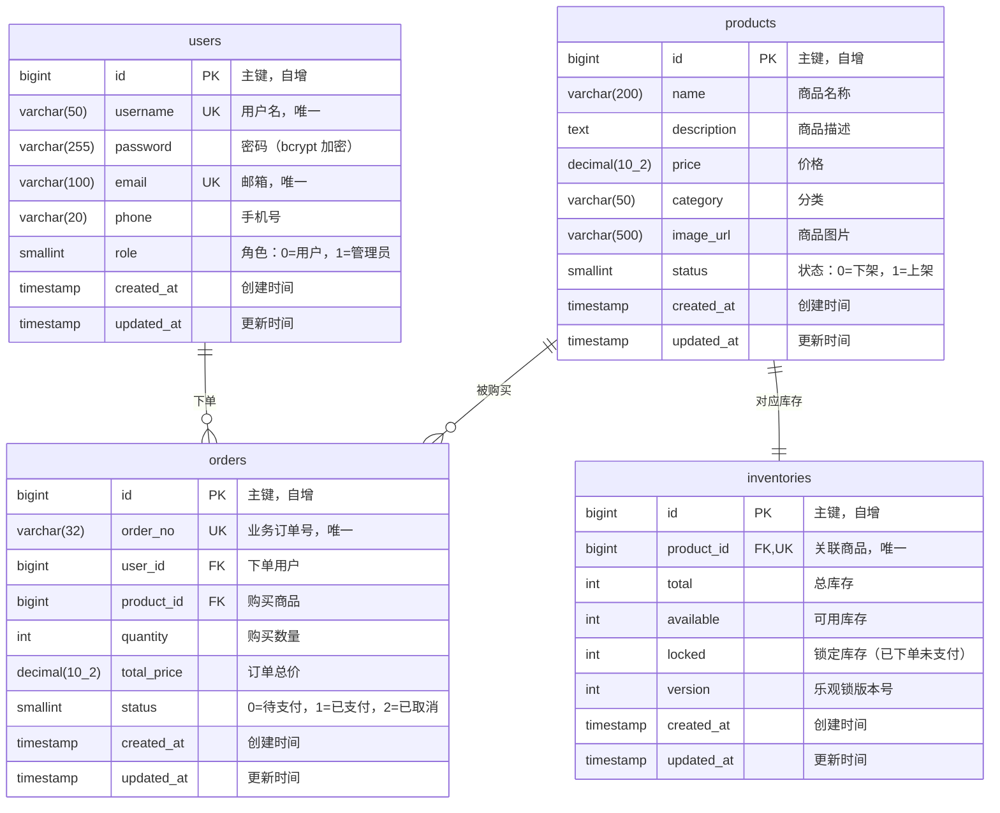
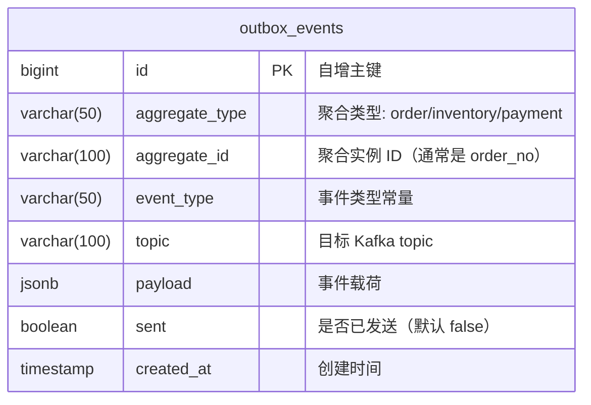
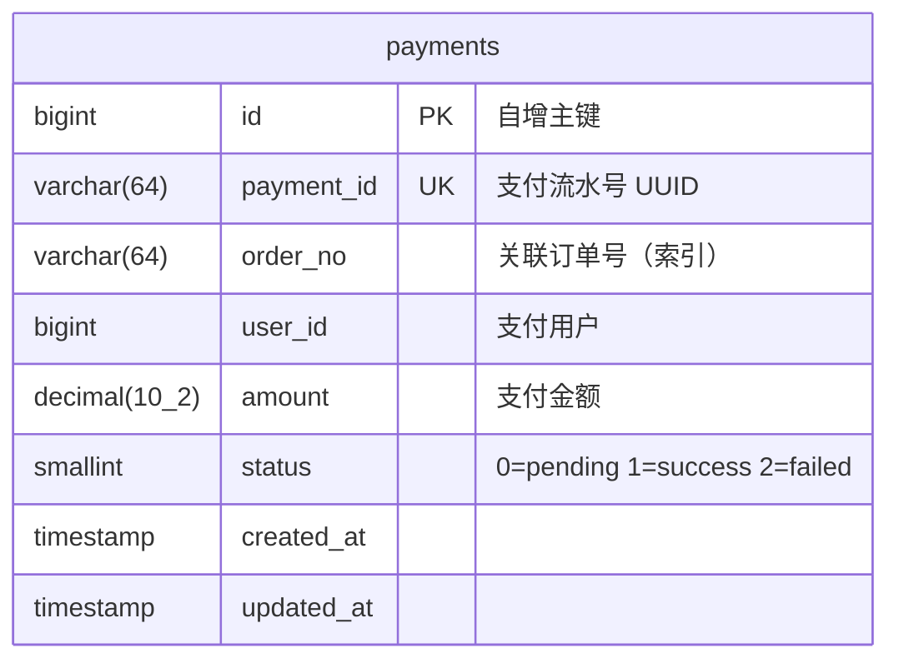

# 数据库 ER 设计

## 1. ER 关系图



## 2. 关联关系说明

| 关系                   | 类型      | 说明                         |
| ---------------------- | --------- | ---------------------------- |
| users → orders         | **1 : N** | 一个用户可以创建多个订单     |
| products → orders      | **1 : N** | 一个商品可以出现在多个订单中 |
| products → inventories | **1 : 1** | 一个商品对应一条库存记录     |

## 3. 表结构详细定义

### 3.1 users（用户表）

| 字段       | 类型         | 约束               | 说明                       |
| ---------- | ------------ | ------------------ | -------------------------- |
| id         | BIGINT       | PK, AUTO INCREMENT | 主键                       |
| username   | VARCHAR(50)  | UNIQUE, NOT NULL   | 用户名                     |
| password   | VARCHAR(255) | NOT NULL           | 密码（bcrypt 加密存储）    |
| email      | VARCHAR(100) | UNIQUE             | 邮箱                       |
| phone      | VARCHAR(20)  |                    | 手机号                     |
| role       | SMALLINT     | DEFAULT 0          | 角色：0=普通用户，1=管理员 |
| created_at | TIMESTAMP    |                    | 创建时间                   |
| updated_at | TIMESTAMP    |                    | 更新时间                   |

### 3.2 products（商品表）

| 字段        | 类型          | 约束               | 说明                 |
| ----------- | ------------- | ------------------ | -------------------- |
| id          | BIGINT        | PK, AUTO INCREMENT | 主键                 |
| name        | VARCHAR(200)  | NOT NULL           | 商品名称             |
| description | TEXT          |                    | 商品描述             |
| price       | DECIMAL(10,2) | NOT NULL           | 价格                 |
| category    | VARCHAR(50)   |                    | 商品分类             |
| image_url   | VARCHAR(500)  |                    | 商品图片链接         |
| status      | SMALLINT      | DEFAULT 1          | 状态：0=下架，1=上架 |
| created_at  | TIMESTAMP     |                    | 创建时间             |
| updated_at  | TIMESTAMP     |                    | 更新时间             |

### 3.3 inventories（库存表）

| 字段       | 类型      | 约束                     | 说明                     |
| ---------- | --------- | ------------------------ | ------------------------ |
| id         | BIGINT    | PK, AUTO INCREMENT       | 主键                     |
| product_id | BIGINT    | FK → products.id, UNIQUE | 关联商品（一对一）       |
| total      | INT       | NOT NULL                 | 总库存量                 |
| available  | INT       | NOT NULL                 | 可用库存量               |
| locked     | INT       | DEFAULT 0                | 锁定数量（已下单未支付） |
| version    | INT       | DEFAULT 0                | 乐观锁版本号             |
| created_at | TIMESTAMP |                          | 创建时间                 |
| updated_at | TIMESTAMP |                          | 更新时间                 |

### 3.4 orders（订单表）

| 字段        | 类型          | 约束               | 说明                         |
| ----------- | ------------- | ------------------ | ---------------------------- |
| id          | BIGINT        | PK, AUTO INCREMENT | 主键                         |
| order_no    | VARCHAR(32)   | UNIQUE             | 业务订单号                   |
| user_id     | BIGINT        | FK → users.id      | 下单用户                     |
| product_id  | BIGINT        | FK → products.id   | 购买商品                     |
| quantity    | INT           | NOT NULL           | 购买数量                     |
| total_price | DECIMAL(10,2) | NOT NULL           | 订单总价                     |
| status      | SMALLINT      | NOT NULL           | 0=待支付，1=已支付，2=已取消 |
| created_at  | TIMESTAMP     |                    | 创建时间                     |
| updated_at  | TIMESTAMP     |                    | 更新时间                     |

## 4. 设计要点

### 4.1 库存表独立于商品表

库存是高频写操作（秒杀场景下大量并发扣减），商品是低频读操作。将库存拆分为独立表后，两者的读写互不阻塞，避免行锁竞争影响商品查询性能。

### 4.2 乐观锁防超卖

库存表的 `version` 字段用于乐观锁控制。扣减库存时 SQL 为：

```sql
UPDATE inventories
SET available = available - ?, locked = locked + ?, version = version + 1
WHERE product_id = ? AND available >= ? AND version = ?
```

如果 `version` 不匹配（说明有并发修改），更新影响行数为 0，触发重试（最多 3 次）。

### 4.3 available + locked 双字段模型

- **下单时：** `available` 减少，`locked` 增加
- **支付后：** `locked` 减少（库存真正消耗）
- **取消时：** `locked` 减少，`available` 增加（库存归还）

这种模型支持预扣库存，确保用户下单后有一定时间完成支付，同时不会超卖。

### 4.4 业务订单号

`order_no` 由**雪花算法**（HW4）生成，41bit 时间戳 + 10bit 节点 ID + 12bit 序列号，趋势递增、对 BTree 友好、跨容器/服务无中心化协调。

### 4.5 订单防重幂等约束（HW4）

`orders` 表追加联合唯一索引 `idx_user_product (user_id, product_id)`，保证同一用户对同一商品**最多只能下单一次**——配合 Redis SETNX 形成"快路径 + 兜底"双保险。

```sql
CREATE UNIQUE INDEX idx_user_product ON orders (user_id, product_id);
```

## 5. HW5+：多库 + 微服务化的拆分

进入 HW5 后单库变为按服务一库一物理实例：

| 数据库         | 拥有方                  | 主要表                              |
|----------------|-------------------------|-------------------------------------|
| **order_db**   | order-service（主+从）  | `users` · `products` · `orders` · `outbox_events` |
| **inventory_db** | inventory-service     | `inventories` · `outbox_events`     |
| **payment_db** | payment-service         | `payments` · `outbox_events`        |

跨库操作不再走分布式事务，而是**事务性 Outbox + 事件驱动 Saga**：业务表写入与 outbox 事件入库是同事务，由 relay 协程异步推到 Kafka，对端服务消费。

## 6. outbox_events（事务性 Outbox 表，HW5）



| 字段           | 类型        | 约束                                        | 说明                                |
|----------------|-------------|---------------------------------------------|-------------------------------------|
| id             | BIGINT      | PK, AUTO INCREMENT                          | 主键                                 |
| aggregate_type | VARCHAR(50) | NOT NULL                                    | 聚合类型（order / inventory / payment）|
| aggregate_id   | VARCHAR(100)| NOT NULL                                    | 聚合实例 ID（通常是 `order_no`）     |
| event_type     | VARCHAR(50) | NOT NULL                                    | 事件常量（如 `ORDER_CREATED`）       |
| topic          | VARCHAR(100)| NOT NULL                                    | 目标 Kafka topic                     |
| payload        | JSONB       | NOT NULL                                    | 事件 JSON                           |
| sent           | BOOLEAN     | DEFAULT false, **复合索引 idx_outbox_unsent** | 是否已成功投递                       |
| created_at     | TIMESTAMP   | autoCreateTime, **复合索引 idx_outbox_unsent**| 时间序                               |

**关键索引：** `idx_outbox_unsent (sent, created_at)` 让 relay 协程的 `WHERE sent = false ORDER BY created_at LIMIT N` 走索引扫描，避免全表轮询。

## 7. payments（支付表，HW5）



| 字段       | 类型           | 约束                | 说明                          |
|------------|----------------|---------------------|-------------------------------|
| id         | BIGINT         | PK, AUTO INCREMENT  | 主键                           |
| payment_id | VARCHAR(64)    | UNIQUE, NOT NULL    | UUID 流水号                    |
| order_no   | VARCHAR(64)    | INDEX, NOT NULL     | 关联订单                       |
| user_id    | BIGINT         | NOT NULL            | 支付用户                       |
| amount     | DECIMAL(10,2)  | NOT NULL            | 支付金额                       |
| status     | SMALLINT       | DEFAULT 0           | 0=pending / 1=success / 2=failed |
| created_at | TIMESTAMP      | autoCreateTime      |                               |
| updated_at | TIMESTAMP      | autoUpdateTime      |                               |

支付记录由 `payment-service` 监听 `PAYMENT_REQUESTED` 事件后创建。HW6 的动态配置 `payment.success_rate` 决定模拟支付的成功概率。

## 8. orders 状态机更新（HW5）

引入支付服务后订单状态从 3 态扩展为 4 态：

| Status | 含义              | 何时进入                        |
|--------|-------------------|---------------------------------|
| 0      | pending           | 秒杀创建瞬间                    |
| 1      | awaiting_payment  | 库存扣减成功，进入支付环节       |
| 2      | paid              | 支付成功                        |
| 3      | cancelled         | 库存扣减失败 / 支付失败 / 用户取消 |

伴随状态流转，inventory 表的 `locked` 字段也对应推进：扣减时 `available → locked`，支付成功时 `locked → sold`（在订单完成事件的消费者中执行 `locked - quantity, total - quantity`）。

## 9. HW3 读写分离层面

`order_db` 启用 PostgreSQL 主从复制：
- **Master :5441** 接收所有 `INSERT/UPDATE/DELETE`
- **Replica :5444** 通过 GORM `DBResolver` 接收 `SELECT`（`RandomPolicy`）
- Replica 缺失时 DBResolver 自动退化为单库（业务无感）
