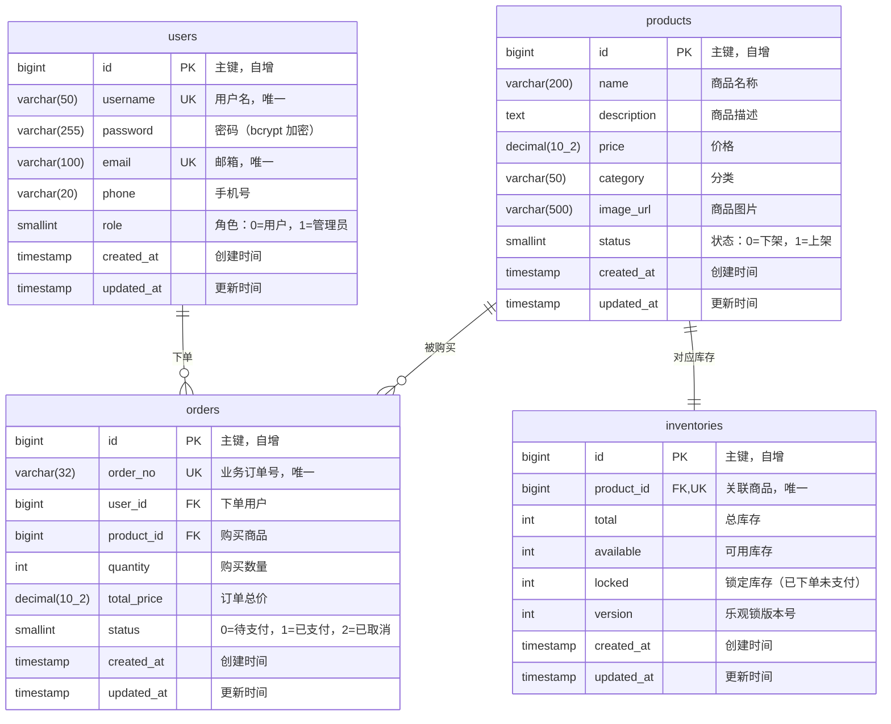

# 数据库 ER 设计

## 1. ER 关系图



## 2. 关联关系说明

| 关系                   | 类型      | 说明                         |
| ---------------------- | --------- | ---------------------------- |
| users → orders         | **1 : N** | 一个用户可以创建多个订单     |
| products → orders      | **1 : N** | 一个商品可以出现在多个订单中 |
| products → inventories | **1 : 1** | 一个商品对应一条库存记录     |

## 3. 表结构详细定义

### 3.1 users（用户表）

| 字段       | 类型         | 约束               | 说明                       |
| ---------- | ------------ | ------------------ | -------------------------- |
| id         | BIGINT       | PK, AUTO INCREMENT | 主键                       |
| username   | VARCHAR(50)  | UNIQUE, NOT NULL   | 用户名                     |
| password   | VARCHAR(255) | NOT NULL           | 密码（bcrypt 加密存储）    |
| email      | VARCHAR(100) | UNIQUE             | 邮箱                       |
| phone      | VARCHAR(20)  |                    | 手机号                     |
| role       | SMALLINT     | DEFAULT 0          | 角色：0=普通用户，1=管理员 |
| created_at | TIMESTAMP    |                    | 创建时间                   |
| updated_at | TIMESTAMP    |                    | 更新时间                   |

### 3.2 products（商品表）

| 字段        | 类型          | 约束               | 说明                 |
| ----------- | ------------- | ------------------ | -------------------- |
| id          | BIGINT        | PK, AUTO INCREMENT | 主键                 |
| name        | VARCHAR(200)  | NOT NULL           | 商品名称             |
| description | TEXT          |                    | 商品描述             |
| price       | DECIMAL(10,2) | NOT NULL           | 价格                 |
| category    | VARCHAR(50)   |                    | 商品分类             |
| image_url   | VARCHAR(500)  |                    | 商品图片链接         |
| status      | SMALLINT      | DEFAULT 1          | 状态：0=下架，1=上架 |
| created_at  | TIMESTAMP     |                    | 创建时间             |
| updated_at  | TIMESTAMP     |                    | 更新时间             |

### 3.3 inventories（库存表）

| 字段       | 类型      | 约束                     | 说明                     |
| ---------- | --------- | ------------------------ | ------------------------ |
| id         | BIGINT    | PK, AUTO INCREMENT       | 主键                     |
| product_id | BIGINT    | FK → products.id, UNIQUE | 关联商品（一对一）       |
| total      | INT       | NOT NULL                 | 总库存量                 |
| available  | INT       | NOT NULL                 | 可用库存量               |
| locked     | INT       | DEFAULT 0                | 锁定数量（已下单未支付） |
| version    | INT       | DEFAULT 0                | 乐观锁版本号             |
| created_at | TIMESTAMP |                          | 创建时间                 |
| updated_at | TIMESTAMP |                          | 更新时间                 |

### 3.4 orders（订单表）

| 字段        | 类型          | 约束               | 说明                         |
| ----------- | ------------- | ------------------ | ---------------------------- |
| id          | BIGINT        | PK, AUTO INCREMENT | 主键                         |
| order_no    | VARCHAR(32)   | UNIQUE             | 业务订单号                   |
| user_id     | BIGINT        | FK → users.id      | 下单用户                     |
| product_id  | BIGINT        | FK → products.id   | 购买商品                     |
| quantity    | INT           | NOT NULL           | 购买数量                     |
| total_price | DECIMAL(10,2) | NOT NULL           | 订单总价                     |
| status      | SMALLINT      | NOT NULL           | 0=待支付，1=已支付，2=已取消 |
| created_at  | TIMESTAMP     |                    | 创建时间                     |
| updated_at  | TIMESTAMP     |                    | 更新时间                     |

## 4. 设计要点

### 4.1 库存表独立于商品表

库存是高频写操作（秒杀场景下大量并发扣减），商品是低频读操作。将库存拆分为独立表后，两者的读写互不阻塞，避免行锁竞争影响商品查询性能。

### 4.2 乐观锁防超卖

库存表的 `version` 字段用于乐观锁控制。扣减库存时 SQL 为：

```sql
UPDATE inventories
SET available = available - ?, locked = locked + ?, version = version + 1
WHERE product_id = ? AND available >= ? AND version = ?
```

如果 `version` 不匹配（说明有并发修改），更新影响行数为 0，触发重试（最多 3 次）。

### 4.3 available + locked 双字段模型

- **下单时：** `available` 减少，`locked` 增加
- **支付后：** `locked` 减少（库存真正消耗）
- **取消时：** `locked` 减少，`available` 增加（库存归还）

这种模型支持预扣库存，确保用户下单后有一定时间完成支付，同时不会超卖。

### 4.4 业务订单号

`order_no` 区别于数据库自增 `id`，采用时间戳 + 序号的格式生成，便于对外展示和跨服务追踪。
